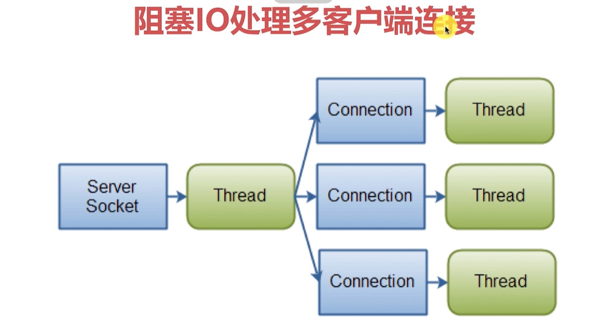

### **简易聊天**

客户端将消息发给服务端，服务端等待转发给其他客户端。

每个客户端都需要服务器进行转发，双通等待。

双通：客户端发送数据到服务器接收通道 + 服务器回送消息发送通道。

每条通道因为堵塞只能使用异步线程实现。


##### 分析：

> 一个客户端：双通， > 2条线程
> 
>n个客户端，2n条线程
>
>服务器实际线程数量： 2n+


客户端数量较多时，
CPU消耗50%， 内存占用很高，线程数量爆发。


#### 优化：

1. 减少线程数量
2. 增加线程执行繁忙状态，减少线程空闲等待时间与线程切换时间
3. 内存，加客户端Buffer复用机制


#### 阻塞IO和非阻塞IO
NIO:
* Buffer 缓冲区，用于数据处理的基础单元，客户端发送与接收数据都需要通过Buffer转发进行。
* Channel 通道，类似于流，但偏向于数据的流通多样性。
* Selectors 选择器，处理客户端所有事件的分发器，用于管理事件。

* Buffer包括：
> ByteBuffer,CharBuffer,ShortBuffer,IntBuffer,LongBuffer,FloatBuffer,DoubleBuffer

* Channel包括：
> FileChannel,SocketChannel,DatagramChannel

Buffer为NIO按块操作提供了基础，数据按“块”传输。一个Buffer代表一块数据。

Buffer中其实是维护了一个数组。

可以从通道读取数据，也可以输出数据到通道，按块进行操作。

NIO可以并发异步读写数据。

##### NIO的API

Selector:向Selector注册一个事件，对应Channel的状态
Channel:Channel状态变化时，触发注册的事件
Buffer:

注册事件：
* SelectionKey.OP_CONNECT 连接就绪
* SelectionKey.OP_ACCEPT  接受就绪
* SelectionKey.OP_READ  读就绪
* SelectionKey.OP_WRITE  写就绪

Selector使用流程：
* open()方法开启一个选择器，给选择器注册需要关注的事件
* register() 将一个Channel注册到选择器，当选择器触发对应关注事件时，回调到Channel中，处理相关数据。
* select()/selectNow() 一个通道Channel，处理一个当前可用，待处理的通道数据。是阻塞操作。
* selectedKeys()拿到当前就绪的通道。

FileChannel不能用于Selector,因为FileChannel不能切换为非阻塞模式。


##### 【异步线程优化】- 监听与数据处理线程分离


优化前的线程模型，每一个客户端对应一个Channel，对应一个读Thread，一个写Thread。

**优化后的线程模型如下**, AccepterThread负责监听新客户端的加入，ProcessorThread可以是单线程轮训或者线程池，专门负责处理客户端新消息的到来。


具体到服务端，多客户端连接，使用了线程池：



##### 消息粘包

依靠判断消息尾部为结束符，遍历字符效率非常低，而且发送的两条消息可能会被当做一条消息。

TCP本质上不会发生数据层面的粘包，但是上层业务层面可能发生粘包。

UDP不保证消息的完整性，所有UDP是可能发生丢包的。

TCP传输有顺序性，校验完整性。

Mina、Netty等框架从根本来说也是为了解决粘包而设计的开发库。


##### 消息不完整

在物理传输层面来讲数据一定是能安全的完整的送达另一端

但另一端可能缓冲区不够或者数据处理上不够完整导致数据只能读取一部分数据。


问题复现：
1. 多消息粘包

   > 复现：
   >
   > Client.java的write()方法中，发送消息时连续发送多条消息：
   >
   > ```
   > private static void write(TCPClient tcpClient) throws IOException {
   >         // 构建键盘输入流
   >         InputStream in = System.in;
   >         BufferedReader input = new BufferedReader(new InputStreamReader(in));
   > 
   >         do {
   >             // 键盘读取一行
   >             String str = input.readLine();
   >             // 发送到服务器
   >             tcpClient.send(str);
   >  			tcpClient.send(str);
   >   			tcpClient.send(str);
   >             if ("00bye00".equalsIgnoreCase(str)) {
   >                 break;
   >             }
   >         } while (true);
   >     }
   > ```
   >
   > TCPServer.java中打印消息时，将分隔符还原：
   >
   > ```java
   > public void onMessageArrived(final ClientHandler handler, final String msg) {
   >         System.out.println("TCPServer get : "+msg.replace("\n","-\\n-"));
   >         // ...
   > }
   > ```
   >
   > 从消息输出可见三条消息在接收端被当作1条消息：
   >
   > b7d0e198-0bbb-490b-a7c1-a966920bb6b9:has
   > has
   > has
   > -\n-has

2. 单消息不完整

   > 复现：
   >
   > 先将缓冲区调足够小，`IoArgs`中,缓冲区大小设为4:
   >
   > ```java
   > public class IoArgs {
   >     private byte[] byteBuffer = new byte[4];
   >     // ...
   > }
   > ```
   >
   > 其次，客户端发送消息：1234567890
   >
   > 服务端收到消息如下：
   >
   > ```shell
   > 客户端信息：/192.168.47.210 P:55212
   > 服务器信息：/192.168.47.210 P:30401
   > 123
   > 567
   > 90
   > ```
   >
   > 可以看到，收到3条消息，4与8被丢掉

3. 消息到达提醒重复触发，（读消息时未设置取消监听）

4. 单次消息重复处理：

   > 主要是处理消息时未取消select监听，尤其当处理消息比较耗时的情况下，此类问题更为常见。
   >
   > 解决方法：读取消息后取消select监听，在`IoSelectorProvider`类中，处理消息方法handleSelection()添加取消select监听: `key.interestOps(key.readyOps() & ~keyOps);`
   >
   > ```java
   > private static void handleSelection(SelectionKey key, int keyOps,
   >                                         HashMap<SelectionKey, Runnable> map,
   >                                         ExecutorService pool) {
   >         // 重点
   >         // 取消继续对keyOps的监听
   >         // key.readyOps() 返回当前已经就绪的事件集合
   >         key.interestOps(key.readyOps() & ~keyOps);
   > 
   >         Runnable runnable = null;
   >         try {
   >             runnable = map.get(key);
   >         } catch (Exception ignored) {
   >             ignored.printStackTrace();
   >         }
   > 
   >         if (runnable != null && !pool.isShutdown()) {
   >             // 异步调度
   >             pool.execute(runnable);
   >         }
   >     }
   > ```

##### 如何有序地混传数据？
1. 数据传输加上开始结束标记
2. 数据传输使用固定头部信息
3. 混合方案：固定数据头，数据加密，数据描述


可以参考http2.0的头部信息组成结构:


**在`SocketChatRoom_T8_msg`主要优化重构，解决了单消息不完整，消息重复发送问题。**

重构后的发送流程：


### 文件传输问题


##### 文件传输与普通传输的区别
1. 最大的区别，文件数据bytes远大于普通数据bytes
2. 文件传输需分片，接收后，组装分片
3. 如何中途取消而不影响后续Packet的发送
4. 文件传输校验，保证数据准确性

【问题】
* 发送中无法取消发送？
* 大文件传输容错率低？
* 同一链接中，当大文件未发送完毕时，无法在中途发送普通消息，一直到文件发送完毕？要解决同时发送多个packet，并且有优先级的概念。


**普通数据与文件数据，传输过程对比：**

如果将文件的Packet直接装进byteArray，将会浪费大量的内存，应该转换为输入流来操作。


> 为了支持文件传输，需要改动点：
>
> 1. Packet改为流传输
> 2. IoArgs改为流输入输出
> 3. Dispatcher调度逻辑进行调整，适配流传输

##### 文件消息模型

1. 发送文件支持取消发送
2. 文件分段传输，增大传输容错率
3. 同一连接实现文件、普通消息优先级


实施：
> 1.根据文件大小计算分片，并读取数据到分片
>
> 2.分片数据固定格式打包发送
>
> 3.分片数据解析与分片组装
>
> 4.DisPatcher调度逻辑 

数据包分片，分为Frame,头帧包含Packet信息

先看看Packet的组成结构：


数据分片在穿插帧的情况下进行Packet组合（难点）


分片消息规则：

帧大小：正整数16位，可表示大小范围2的16次方减去1（也就是0），最大25535。

帧类型：如果是头帧，则创建对应的Packet，否则将当前帧加入Packet。

标志信息：加密解密标志。

唯一标志：0~255作为标记，与Packet对应。


那么，加入帧概念后的Packet结构，应该像这样：


将头帧存入Packet头部。

具体来说，帧的数据结构是这样的：


消息分片的接收:

两个Packet，P-2与P-1并行发送。

当接收到第3个分片Frame数据，即p2-1的时候，因为是另一个Packet的数据要开始接收了，于是构建一个新的Packet来承载。

从而达到同时发送多个数据包或消息。


### 客户端服务器连接数量

客户端与服务器之间最多建立多少个Socket链接?

49152到65535号端口属于“动态端口”范围，没有端口可以被正式地注册占用。客户端端口可以在此区间动态分配。

可以动态分配65535-49152 = 16383个动态端口，自己的电脑连接本地服务器可以有16383个链接。

模拟百万级别并发量，开启100个Server需要100台设备，则可建立总连接100*16383个。

##### 问题1:

100个客户端向服务端发送消息，持续时间10分钟，遇到内存逐渐开始暴涨：


--------------------------------------------------


经vmVisual分析，控制台打印占据了相当大的cpu资源。


## NIO相关方法解析


### 一、方法整体流程梳理
该方法`handleSelection`的核心作用是：**处理`SelectionKey`上就绪的事件（`OP_READ`或`OP_WRITE`），并通过线程池异步执行对应的任务，同时暂时取消对该事件的监听**。整体流程可分为3步：


#### 1. 暂时取消对目标事件的监听（核心代码）
```java
key.interestOps(key.readyOps() & ~keyOps);
```
- 作用：从`SelectionKey`的“感兴趣事件集”中移除当前处理的事件（`keyOps`，即`OP_READ`或`OP_WRITE`），避免`Selector`在事件处理期间重复触发该事件。


#### 2. 获取事件对应的处理任务
```java
Runnable runnable = map.get(key);
```
- 从`HashMap`中获取与当前`SelectionKey`绑定的任务（`Runnable`），该任务通常是事件的具体处理逻辑（如读取数据、写入数据）。


#### 3. 异步执行任务
```java
if (runnable != null && !pool.isShutdown()) {
    pool.execute(runnable);
}
```
- 通过线程池异步执行任务，避免阻塞`Selector`的轮询线程（NIO的核心线程）。


### 二、关键代码解析：`key.interestOps(key.readyOps() & ~keyOps)`
这句话的本质是**“在处理某个就绪事件时，暂时取消对该事件的监听”**，需结合`SelectionKey`的两个核心属性理解：


#### 1. `SelectionKey`的两个核心属性
- **`interestOps`（感兴趣的事件集）**：  
  由`Channel`注册到`Selector`时指定（如`OP_READ`、`OP_WRITE`），表示`Selector`需要监听该`Channel`上的哪些事件。`Selector`会持续轮询，只有当`interestOps`中的事件就绪时，才会将该`SelectionKey`加入“就绪集合”。
  
- **`readyOps`（已就绪的事件集）**：  
  表示当前`Channel`上已经实际发生的事件（是`interestOps`的子集）。例如，若`interestOps`包含`OP_READ`，且`Channel`有数据可读，则`readyOps`会包含`OP_READ`。


#### 2. 代码逻辑拆解
- `~keyOps`：对目标事件（`OP_READ`或`OP_WRITE`）进行按位取反，得到“除了该事件之外的所有事件”的掩码。  
  例：若`keyOps=OP_READ`（二进制`100`），则`~keyOps`为`...11111011`（仅清除`OP_READ`对应的位）。

- `key.readyOps() & ~keyOps`：从当前就绪的事件集中移除`keyOps`对应的事件，得到“剩余就绪事件”的集合。

- `key.interestOps(...)`：将`SelectionKey`的“感兴趣事件集”更新为上述结果，即**不再对`keyOps`事件感兴趣**。


#### 3. 为什么要这么处理？
核心目的是**避免事件重复触发导致的资源浪费或逻辑错误**。  
- NIO中，`Selector`的`select()`方法会不断轮询所有注册的`SelectionKey`，只要`Channel`上的`interestOps`事件就绪（如`OP_READ`对应的缓冲区有数据），就会将该`key`加入就绪集合。  
- 若不取消`keyOps`的监听，在异步任务（如读取数据）执行期间，`Selector`可能再次检测到该事件就绪（例如数据未读完），导致线程池重复提交相同任务，造成重复处理、数据混乱或线程资源耗尽。  

**举例**：  
- 当`Channel`有数据可读时，`OP_READ`事件就绪，`Selector`通知该`key`，调用`handleSelection`。  
- 执行`key.interestOps(...)`后，`key`不再监听`OP_READ`，即使缓冲区还有数据，`Selector`也不会再将该`key`加入就绪集合。  
- 当异步任务处理完数据（如读完缓冲区）后，再通过`key.interestOps(key.interestOps() | OP_READ)`重新注册`OP_READ`，确保后续数据能被正常处理。  


### 三、`SelectionKey.interestOps()` API的作用（结合源码分析）
`interestOps()`是`SelectionKey`的核心方法，用于**管理`Channel`向`Selector`注册的“感兴趣的事件集”**，是NIO多路复用机制的基础。


#### 1. 源码层面的定义（OpenJDK 11）
`SelectionKey`是一个抽象类，其`interestOps()`方法定义如下：
```java
public abstract int interestOps(); // 获取当前感兴趣的事件集
public abstract SelectionKey interestOps(int ops); // 设置感兴趣的事件集
```
- 实现类（如`SunNioSocket.SelectionKeyImpl`）中，`interestOps`通过一个`int`字段存储事件掩码（每一位代表一种事件，如`OP_READ=1<<0`，`OP_WRITE=1<<2`等）。


#### 2. 核心作用
- **决定`Selector`的监听范围**：`Selector`只会关注`interestOps`中包含的事件，未注册的事件即使就绪，也不会被`Selector`检测到。  
- **动态调整监听事件**：通过`interestOps(int ops)`可以随时添加/移除感兴趣的事件（如读完数据后移除`OP_READ`，写完后移除`OP_WRITE`），实现灵活的事件管理。  
- **与`readyOps`的联动**：`readyOps`是`interestOps`的子集，只有`interestOps`中包含的事件，才可能出现在`readyOps`中（`Selector`会过滤掉未注册的事件）。  


#### 3. 与`Selector`的协作流程
1. `Channel`通过`register(selector, ops)`向`Selector`注册，`ops`即为初始`interestOps`。  
2. `Selector.select()`阻塞等待，内核检测所有注册的`Channel`，将`interestOps`中已就绪的事件标记到`readyOps`。  
3. 应用程序遍历就绪的`SelectionKey`，处理`readyOps`中的事件。  
4. 处理过程中，通过`interestOps()`动态调整监听事件（如暂时移除已处理的事件）。  


### 四、总结
1. **方法流程**：`handleSelection`通过暂时取消对当前事件（`OP_READ`/`OP_WRITE`）的监听，避免重复处理，然后异步执行事件对应的任务，保证NIO处理的高效性。  

2. **关键代码意义**：`key.interestOps(key.readyOps() & ~keyOps)`的作用是“在处理事件时临时移除该事件的监听”，防止`Selector`重复触发同一事件导致的资源浪费。  

3. **`interestOps()`的核心作用**：管理`Channel`向`Selector`注册的感兴趣事件，是`Selector`实现多路复用的基础，决定了`Selector`需要监听哪些事件，从而实现“单线程管理多通道”的高效IO模型。


