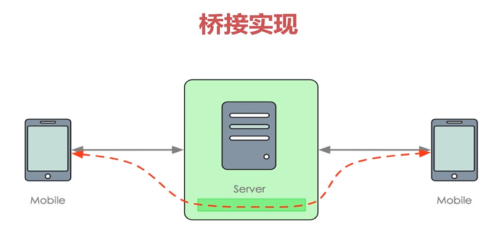
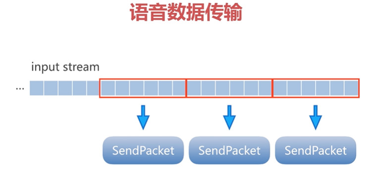

### **语音消息**

即时语音，基于网络快速传输语音信息，编码发送，接收解码。

RTMP 实时消息传输协议

RTMP有多个变种，如RTMPT，RTMPS,RTMPE等

RTMP协议基于TCP

##### Client to Client分析：

> 转发方案：数据送达服务器，服务器再转发给其他客户端
>
> 桥接方案：客户端与客户端，通过服务器建立私有管道，服务器起代理桥接的作用
>
> 简单来说:数据在管道消费传输，不上升到业务层
>
> 服务器:起到代理桥接的作用

即时语音与即时视频是同样的技术。

直播还涉及CDN,数据暂存，数据分发技术。

服务器不做识别与解析，不解析为Packet再转发，而是将channel管道直接转发给其他客户端：

数据传输流程：

> 从SendPacket将数据填充到n个Frame中，再将Frames填充到IoArgs中，通过socket将IoArg传给另一客户端。另一客户端接收到IoArgs，解析Frame,然后拿到ReceivePacket。

以下方案，普通数据传输，一段语音可能会分装成多个Packet，如果多个Packet传输时间差异较大，那就会对语音及时性产生影响。

所以，考虑将一段语音封装成一个Packet.

#### RTMP

基于TCP，是一个协议族，包括rtmp基本协议以及RTMPT/RTMPS/RTMPE等多种变种。

群聊技术：

* 转发：数据到达服务器，再由服务器转发给客户端。
* 桥接：客户端与客户端通过服务器建立私有管道。数据在管道消费传输，不上升到业务层。服务器起到代理桥接的作用。

整个inputstream流封装成Packet,从而响应及时性。

相关类：

`StreamDirectSendPacket.java`
`StreamDirectReceivePacket.java`

Packet(inputstream) ----------------------write----------------------->  IoArgs

inputStream ----------------------------buffer/loop------------------->Frame

Frame------------>IoArgs

SendPacket ------>Frame....Frame ------------------->IoArgs

ReceivePacket <---------------Frame...Frame <-------IoArgs

数据传输路径

语音包 DirectPacket 大小不固定,同时包含了inputStream、outputStream

#### 服务器桥接改造

**环形缓冲区/圆形缓冲区**：

是一个固定尺寸，数据头尾相结合的数据结构，适合缓存数据流。

当一个元素被删除后，其余元素不需要移动位置，并满足先进先出的规则。

发送数据和接收数据的速度不一定相同，所以需要一个缓冲区，

用一个环形链表和头尾指针表示，头指针表示读的位置，尾指针表示写的位置，当头尾指针相遇时，表示缓冲区为空，没有数据。

改造：

##### 语音数据编码

语音编码技术：

* Gxx系列：G711,G722,G723.1
* AMRNB/WB, Speex, ILBC/ISAC
* Opus/EVS 开源
* Oboe谷歌高性能-自动延迟调整

Opus的优势：

* 采样率从8到48kHz，比特率从6kb/s到510kb/s
* 对固定码率CBR和可变码率VBR都支持
* 支持语音和音乐，支持单声道和立体声
* 支持多通道（最多255通道）

发送数据调度流程：

以上流程的缺点：write处理流程需要数据，要去weakUP流程，先唤醒，再注册监听，等待loop调度。效率不高。

优化后：

线程直接调用write()尝试输出数据，如果失败，则说明socket未就绪，则先weakuo再注册。

**多线程调度瓶颈：**

1. 对于多核cpu,有临界值存在，要尽可能少的长时间占用临界资源。
2. 同步块缩小范围，或者同步块让线程独占。

