### **语音消息**

即时语音，基于网络快速传输语音信息，编码发送，接收解码。

RTMP 实时消息传输协议

RTMP有多个变种，如RTMPT，RTMPS,RTMPE等

RTMP协议基于TCP

##### Client to Client分析：

> 转发方案：数据送达服务器，服务器再转发给其他客户端
>
> 桥接方案：客户端与客户端，通过服务器建立私有管道，服务器起代理桥接的作用
>
> 简单来说:数据在管道消费传输，不上升到业务层
>
> 服务器:起到代理桥接的作用


即时语音与即时视频是同样的技术。

直播还涉及CDN,数据暂存，数据分发技术。


服务器不做识别与解析，不解析为Packet再转发，而是将channel管道直接转发给其他客户端：

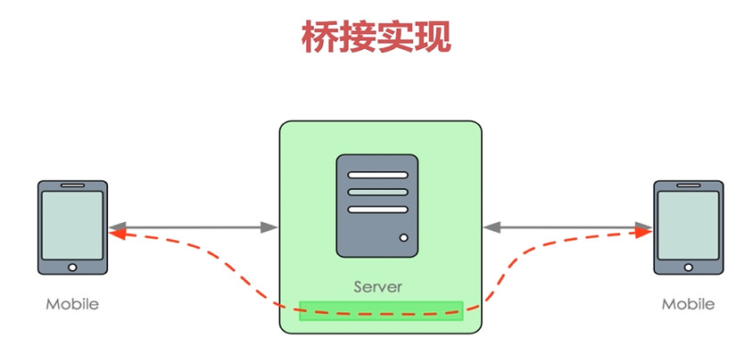

数据传输流程：


> 从SendPacket将数据填充到n个Frame中，再将Frames填充到IoArgs中，通过socket将IoArg传给另一客户端。另一客户端接收到IoArgs，解析Frame,然后拿到ReceivePacket。


以下方案，普通数据传输，一段语音可能会分装成多个Packet，如果多个Packet传输时间差异较大，那就会对语音及时性产生影响。

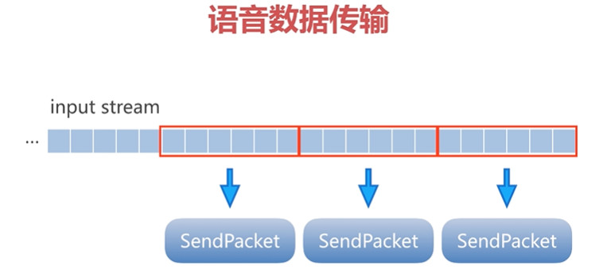

所以，考虑将一段语音封装成一个Packet.


#### RTMP

基于TCP，是一个协议族，包括rtmp基本协议以及RTMPT/RTMPS/RTMPE等多种变种。


群聊技术：

* 转发：数据到达服务器，再由服务器转发给客户端。
* 桥接：客户端与客户端通过服务器建立私有管道。数据在管道消费传输，不上升到业务层。服务器起到代理桥接的作用。

整个inputstream流封装成Packet,从而响应及时性。

相关类：

`StreamDirectSendPacket.java`
`StreamDirectReceivePacket.java`

Packet(inputstream) ----------------------write----------------------->  IoArgs

inputStream ----------------------------buffer/loop------------------->Frame


Frame------------>IoArgs


SendPacket ------>Frame....Frame ------------------->IoArgs

ReceivePacket <---------------Frame...Frame <-------IoArgs

数据传输路径


语音包 DirectPacket 大小不固定,同时包含了inputStream、outputStream


#### 服务器桥接改造

**环形缓冲区/圆形缓冲区**：

是一个固定尺寸，数据头尾相结合的数据结构，适合缓存数据流。

当一个元素被删除后，其余元素不需要移动位置，并满足先进先出的规则。

发送数据和接收数据的速度不一定相同，所以需要一个缓冲区，


用一个环形链表和头尾指针表示，头指针表示读的位置，尾指针表示写的位置，当头尾指针相遇时，表示缓冲区为空，没有数据。


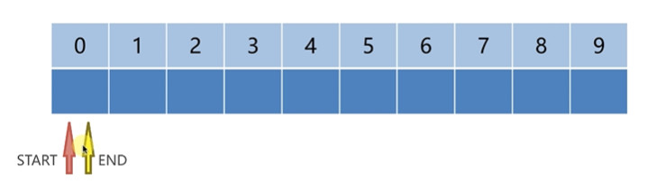

改造：


服务器将双方的发送者与接收者进行桥接：

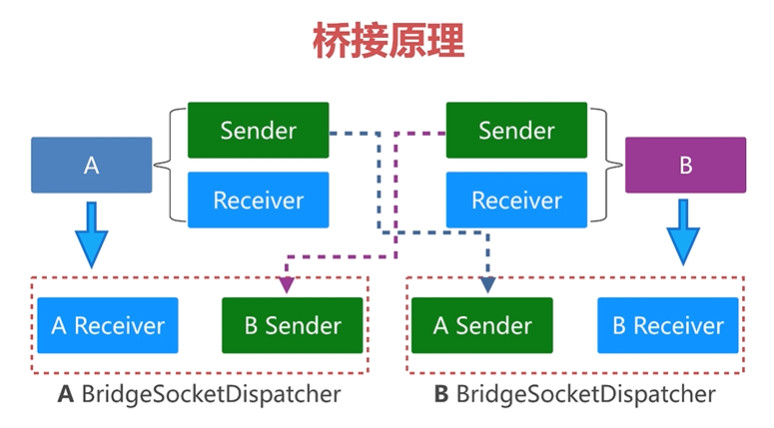

A客户端接收到的数据放入环形缓冲区中，然后利用B客户端的发送端进行发送，B的接收端会接收数据。

反过来也一样。


#### 难点：

1. **如何识别需要发起桥接的命令？**
2. **如何建立管道，即room房间？**
3. **房间建立，销毁，连接复用。**


##### 语音数据编码

语音编码技术：

* Gxx系列：G711,G722,G723.1
* AMRNB/WB, Speex, ILBC/ISAC
* Opus/EVS 开源
* Oboe谷歌高性能-自动延迟调整

Opus的优势：

* 采样率从8到48kHz，比特率从6kb/s到510kb/s
* 对固定码率CBR和可变码率VBR都支持
* 支持语音和音乐，支持单声道和立体声
* 支持多通道（最多255通道）


### Android客户端集成

编解码器采用Opus开源库封装。

去掉服务发现功能，直接输入服务器IP与端口。


### 性能测试

2000个客户端，4个线性，每个线程间隔400ms向服务端发送数据。

数据到达服务端，会被原封不动回给客户端。

不考虑发送消耗，并发量：2000*4/400*1000 = 2w/s 算上来回2次数据解析：4w/s


服务端测试情况：

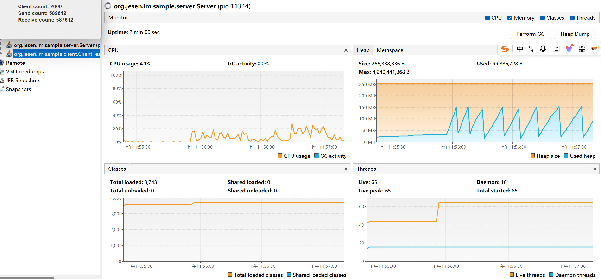


客户端测试情况：

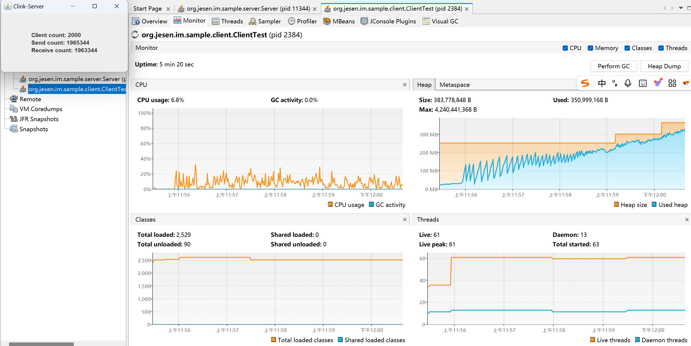

可见，随着并发量上升，客户端内存逐渐暴涨。服务端内存较为稳定。


客户端线程运行情况：

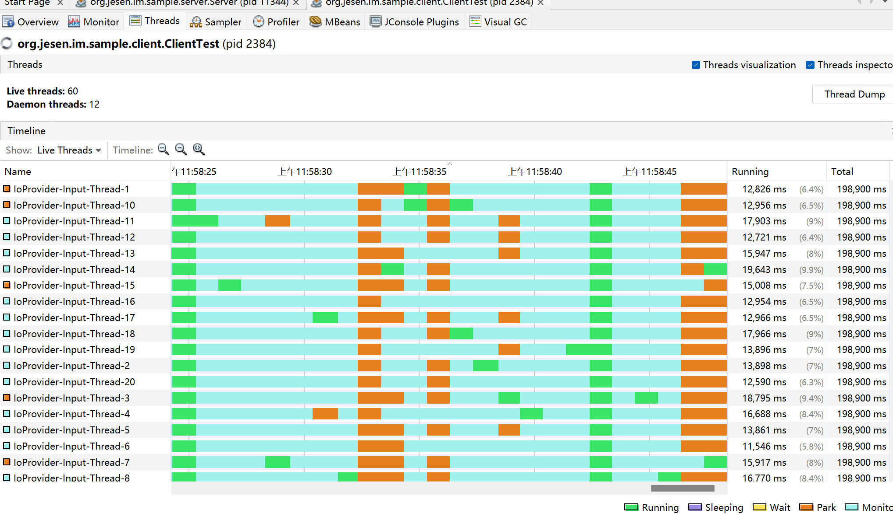

#### 修复：

```shell
c3c237b (HEAD -> main, origin/main, origin/HEAD) [60] Fixed the problem of CUP and memory for ClientTest.

# 测试：
# 从之前的20个接收线程20个发送线程，到目前的4线程发送4线程接收。线程运行状态较好。
# 内存使用情况下降
```

通过减少线程池线程数量，减少客户端数据的生产速度，避免不必要的数据堆积，内存回到合理位置，线程的空闲与浪费相对减少，提高线程利用率。修复后的ClientTest，在2000个客户端并行发送百万级别时，内存与线程情况如下：

优化-客户端-cpu与内存：

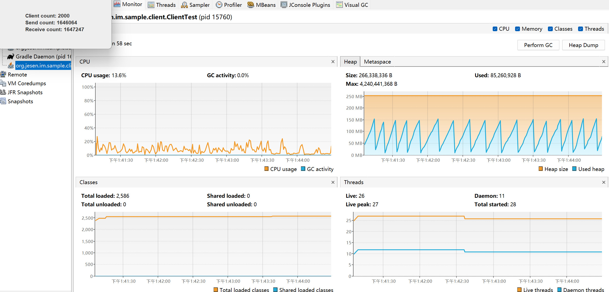

优化-客户端-线程：

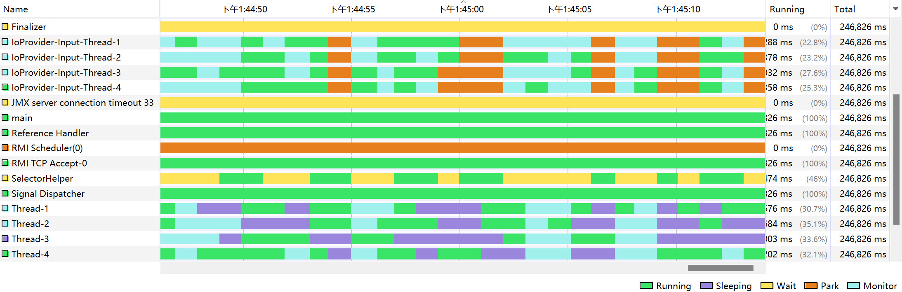

目前的数据调度情况：

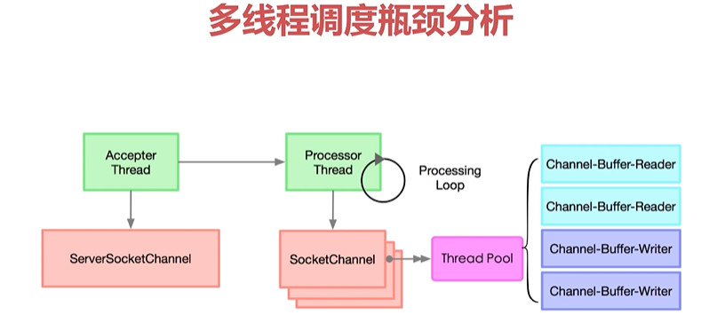

监听channel事件情况，事件可读/可写时，放入线程池。


发送数据调度流程：


“Loop Thread”: 线程循环中检测Select的就绪状态Select.select().

此时，另一个线程Thread想发送数据，则需要registerOutput():

首先select.weakup()唤醒select等待拿到select的锁，然后register(),之后释放select锁，此时“Loop thread”拿回锁，继续循环检测，可读就绪时，通过handeSelection()拿到SelectKey,通过SelectKey拿到可读channel,拿到后，丢到线程池去写入数据。再次尝试唤醒，循环以上流程。


以上流程的缺点：想注册Output的读取，采取了一系列相关的唤醒流程，write处理流程需要数据，要去weakUP流程，先唤醒，再注册监听，等待loop调度。效率不高。

**优化后**：

线程直接调用write()尝试输出数据，如果成功，那继续发送下一条数据。如果失败，则说明socket未就绪，则先weakup再注册再丢到线程池：


**多线程调度瓶颈：**

1. 对于多核cpu,有临界值存在，要尽可能少的长时间占用临界资源。线程不应越多越好，减少线程等待与cpu空转。
2. 同步块缩小范围，或者同步块让线程独占。

单线程IO调度：

```shell
c0cacc1 (HEAD -> main, origin/main, origin/HEAD) [61] Client send data in single thread and the CUP and memory be more better.
# 单线程调度优化后：
# 客户端IO调度线程从4个变到1个，运行状态良好
# 数据传输数据7.9MB/s
# 带宽60Mbps
# cpu下降了，20%以下
# 内存峰值150MB，变化不大
```

单线程IO调度优化-客户端-cpu与内存：

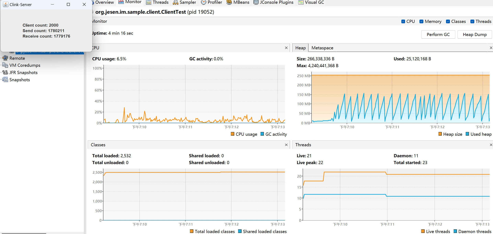


单线程IO调度优化-客户端-线程：

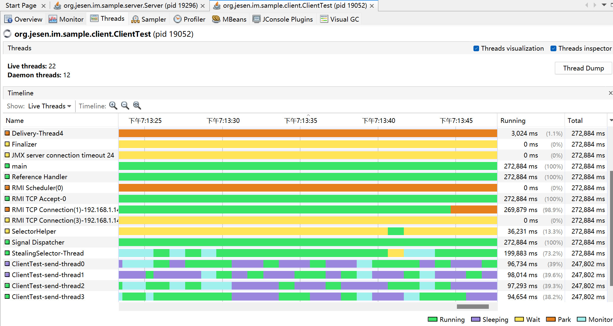

单线程IO调度优化-服务端-线程：

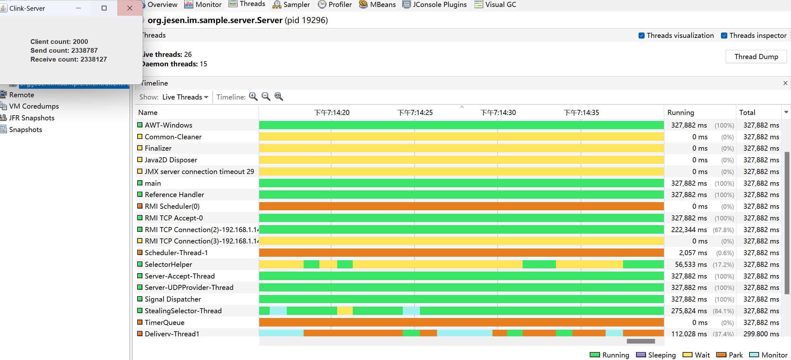

#### SelectionKey

在 Java NIO 中，`SelectionKey.interestOps(ops)` 是控制 **Selector 对 Channel 的事件监听范围** 的核心 API。
`SelectionKey` 是 `Channel` 注册到 `Selector` 时返回的 “注册凭证”，其中 `interestOps`（感兴趣的事件集）决定了：**Selector 在轮询时，需要关注该 Channel 上哪些类型的事件**。

调用 `interestOps(ops)` 后，Selector 会 **更新对该 Channel 的监听范围**：

- 后续调用 `selector.select()` 时，仅当 `ops` 中包含的事件在 Channel 上就绪时，该`SelectionKey`才会被加入 “就绪集合”（`selectedKeys()`）；
- 未包含在`ops`中的事件，即使在 Channel 上发生，Selector 也会忽略，不会将该键加入就绪集合。

`SelectionKey.interestOps()`错误状态:

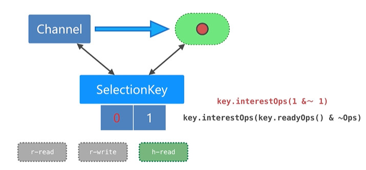

SelectionKey的状态在`SelectionKey.OP_READ 、 SelectionKey.OP_WRITE`(1和4)之间切换。

（上图蓝色）左边是感兴趣的事件（比如5,读和写都想关注），右边是就绪状态（比如1，Read）,读就绪后，想调用SelectionKey.interestOps()的目的应该是要对写感兴趣(SelectionKey.OP_WRITE), 即左边目标是要为4，但是以上操作`key.interestOps(key.readyOps() | registerOps)`实际上是`key.interestOps(当前就绪的读也就是1 | 当前的ops读也就是1)`得到0。

传入`0`表示 **清除所有感兴趣的事件**（即 “不关注任何事件”），此时：

- 无论 Channel 上发生什么事件（如可读、可写），Selector 的`select()`都不会将该`SelectionKey`加入就绪集合；
- 应用程序通过`selector.selectedKeys()`无法获取该键，也就不会处理该 Channel 的任何事件。
- `interestOps(0)` 只是 “暂时停止监听”，后续可以通过 `interestOps(ops)` 重新设置感兴趣的事件（如 `key.interestOps(SelectionKey.OP_READ)`），Selector 会恢复对该 Channel 的监听。

###### 相关拓展：

>`interestOps(0)` 常用于 **“暂时挂起对 Channel 的监听”**，例如：
>
>- 当 Channel 正在处理某个事件（如读取大数据）时，暂时设置`interestOps(0)`，避免 Selector 重复触发同一事件（如数据未读完时再次触发 OP_READ）；
>- 处理完成后，再重新设置`interestOps(OP_READ)`，恢复监听。
>- 需要注意 `interestOps(0)` 和 “取消键” 的本质区别：
>  - `interestOps(0)`：**键仍然有效**，只是暂时不监听事件，可随时恢复；
>  - `key.cancel()`：**键被永久失效**，Selector 会将其从注册集合中移除，之后无法再通过该键操作 Channel（`isValid()`返回`false`）。

key的状态流转：

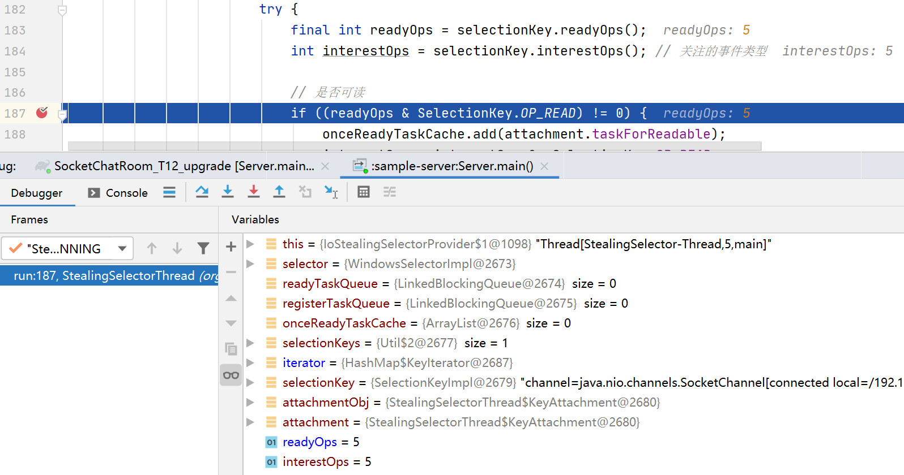

......图片省略

#### 多线程窃取任务调度

```shell
# 26bc3f6 (HEAD -> main) [63] Steal tasks to the orthers When the thread is busy.

# 客户端与服务端的调度线程池，线程数量变为3
# cpu略有上升，3个线程并发度较高
```


### **内存复用问题：**

1. 频繁创建IoTask对象

```java
// StealingSelectorThread.java
public boolean register(SocketChannel channel, int ops, IoProvider.HandleProviderCallback callback) {
        if (channel.isOpen()) {
            IoTask ioTask = new IoTask(channel, callback, ops);
            mRegisterTaskQueue.offer(ioTask);
            return true;
        }
        return false;
}
```

> 优化：将task的执行封装进IoTask，复用对象，减少创建。

2. 频繁调用，数据生产者过快，内存暴增

```java
// AsyncSendDispatcher.java
@Override
    public void send(SendPacket packet) {
        try {
            queue.put(packet);
            requestSend(false);
        } catch (InterruptedException e) {
            e.printStackTrace();
        }
}
```

> 优化：将queue改为阻塞队列BlockingQueue，使用LinkedBlockingQueue的地方换成有界队列。


优化后，CPU明显降低，平均8%，内存经过GC之后，平均保持在30MB:

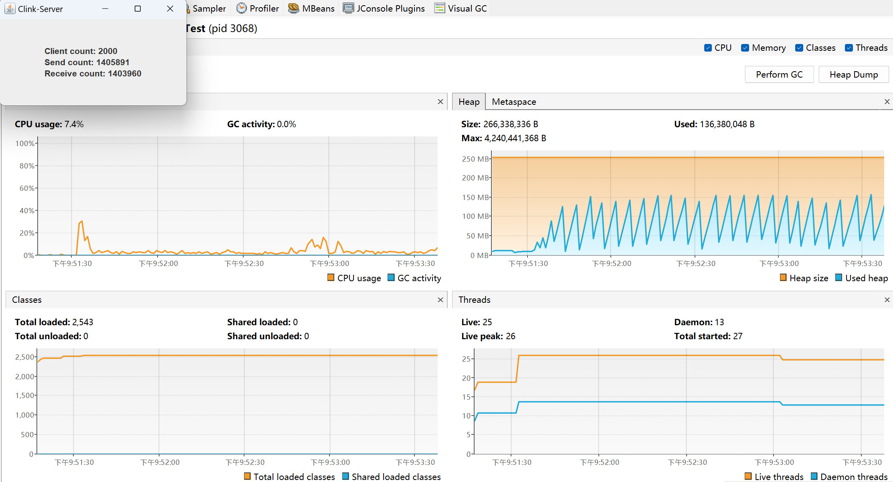


使用LongAdder的情形，看起来变化不大：

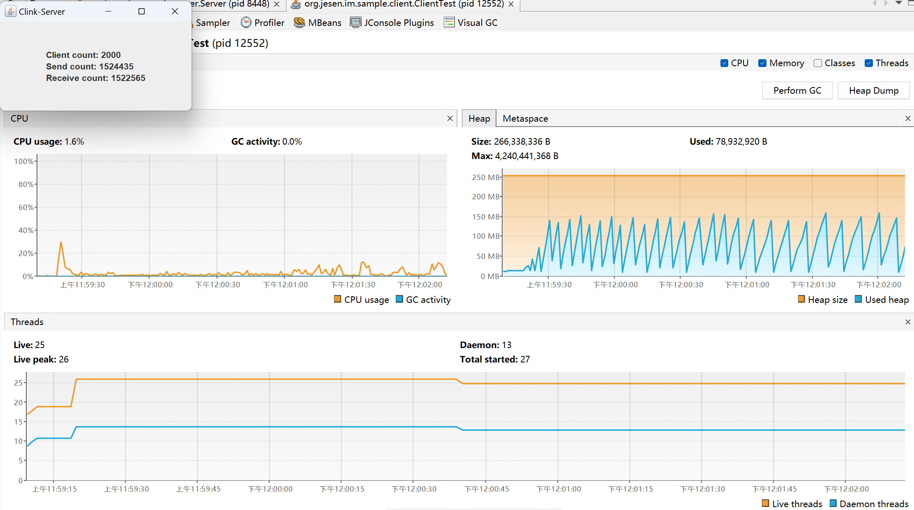
