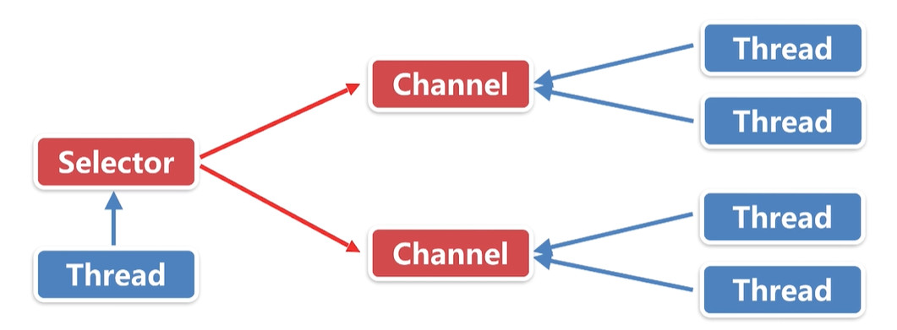

### **简易聊天**

客户端将消息发给服务端，服务端等待转发给其他客户端。

每个客户端都需要服务器进行转发，双通等待。

双通：客户端发送数据到服务器接收通道 + 服务器回送消息发送通道。

每条通道因为堵塞只能使用异步线程实现。


##### 分析：

> 一个客户端：双通， > 2条线程
> 
>n个客户端，2n条线程
>
>服务器实际线程数量： 2n+


客户端数量较多时，
CPU消耗50%， 内存占用很高，线程数量爆发。


#### 优化：

1. 减少线程数量
2. 增加线程执行繁忙状态，减少线程空闲等待时间与线程切换时间
3. 内存，加客户端Buffer复用机制


#### 阻塞IO和非阻塞IO
NIO:
* Buffer 缓冲区，用于数据处理的基础单元，客户端发送与接收数据都需要通过Buffer转发进行。
* Channel 通道，类似于流，但偏向于数据的流通多样性。
* Selectors 选择器，处理客户端所有事件的分发器，用于管理事件。

* Buffer包括：
> ByteBuffer,CharBuffer,ShortBuffer,IntBuffer,LongBuffer,FloatBuffer,DoubleBuffer

* Channel包括：
> FileChannel,SocketChannel,DatagramChannel

Buffer为NIO按块操作提供了基础，数据按“块”传输。一个Buffer代表一块数据。

Buffer中其实是维护了一个数组。

可以从通道读取数据，也可以输出数据到通道，按块进行操作。

NIO可以并发异步读写数据。

##### NIO的API

Selector:向Selector注册一个事件，对应Channel的状态
Channel:Channel状态变化时，触发注册的事件
Buffer:

注册事件：
* SelectionKey.OP_CONNECT 连接就绪
* SelectionKey.OP_ACCEPT  接受就绪
* SelectionKey.OP_READ  读就绪
* SelectionKey.OP_WRITE  写就绪

Selector使用流程：
* open()方法开启一个选择器，给选择器注册需要关注的事件
* register() 将一个Channel注册到选择器，当选择器触发对应关注事件时，回调到Channel中，处理相关数据。
* select()/selectNow() 一个通道Channel，处理一个当前可用，待处理的通道数据。是阻塞操作。
* selectedKeys()拿到当前就绪的通道。

FileChannel不能用于Selector,因为FileChannel不能切换为非阻塞模式。

##### 【异步线程优化】- 监听与数据处理线程分离



优化前的线程模型，每一个客户端对应一个Channel，对应一个读Thread，一个写Thread。

**优化后的线程模型如下**, AccepterThread负责监听新客户端的加入，ProcessorThread可以是单线程轮训或者线程池，专门负责处理客户端新消息的到来。


具体到服务端，多客户端连接，使用了线程池：


##### 消息粘包

依靠判断消息尾部为结束符，遍历字符效率非常低，而且发送的两条消息可能会被当做一条消息。

TCP本质上不会发生数据层面的粘包，但是上层业务层面可能发生粘包。

UDP不保证消息的完整性，所有UDP是可能发生丢包的。

TCP传输有顺序性，校验完整性。

Mina、Netty等框架从根本来说也是为了解决粘包而设计的开发库。


##### 消息不完整

在物理传输层面来讲数据一定是能安全的完整的送达另一端

但另一端可能缓冲区不够或者数据处理上不够完整导致数据只能读取一部分数据。


问题复现：
1. 多消息粘包

   > 复现：
   >
   > Client.java的write()方法中，发送消息时连续发送多条消息：
   >
   > ```
   > private static void write(TCPClient tcpClient) throws IOException {
   >         // 构建键盘输入流
   >         InputStream in = System.in;
   >         BufferedReader input = new BufferedReader(new InputStreamReader(in));
   > 
   >         do {
   >             // 键盘读取一行
   >             String str = input.readLine();
   >             // 发送到服务器
   >             tcpClient.send(str);
   >  			tcpClient.send(str);
   >   			tcpClient.send(str);
   >             if ("00bye00".equalsIgnoreCase(str)) {
   >                 break;
   >             }
   >         } while (true);
   >     }
   > ```
   >
   > TCPServer.java中打印消息时，将分隔符还原：
   >
   > ```java
   > public void onMessageArrived(final ClientHandler handler, final String msg) {
   >         System.out.println("TCPServer get : "+msg.replace("\n","-\\n-"));
   >         // ...
   > }
   > ```
   >
   > 从消息输出可见三条消息在接收端被当作1条消息：
   >
   > b7d0e198-0bbb-490b-a7c1-a966920bb6b9:has
   > has
   > has
   > -\n-has

2. 单消息不完整

   > 复现：
   >
   > 先将缓冲区调足够小，`IoArgs`中,缓冲区大小设为4:
   >
   > ```java
   > public class IoArgs {
   >     private byte[] byteBuffer = new byte[4];
   >     // ...
   > }
   > ```
   >
   > 其次，客户端发送消息：1234567890
   >
   > 服务端收到消息如下：
   >
   > ```shell
   > 客户端信息：/192.168.47.210 P:55212
   > 服务器信息：/192.168.47.210 P:30401
   > 123
   > 567
   > 90
   > ```
   >
   > 可以看到，收到3条消息，4与8被丢掉

3. 消息到达提醒重复触发，（读消息时未设置取消监听）

4. 单次消息重复处理：

   > 主要是处理消息时未取消select监听，尤其当处理消息比较耗时的情况下，此类问题更为常见。
   >
   > 解决方法：读取消息后取消select监听，在`IoSelectorProvider`类中，处理消息方法handleSelection()添加取消select监听: `key.interestOps(key.readyOps() & ~keyOps);`
   >
   > ```java
   > private static void handleSelection(SelectionKey key, int keyOps,
   >                                         HashMap<SelectionKey, Runnable> map,
   >                                         ExecutorService pool) {
   >         // 重点
   >         // 取消继续对keyOps的监听
   >         // key.readyOps() 返回当前已经就绪的事件集合
   >         key.interestOps(key.readyOps() & ~keyOps);
   > 
   >         Runnable runnable = null;
   >         try {
   >             runnable = map.get(key);
   >         } catch (Exception ignored) {
   >             ignored.printStackTrace();
   >         }
   > 
   >         if (runnable != null && !pool.isShutdown()) {
   >             // 异步调度
   >             pool.execute(runnable);
   >         }
   >     }
   > ```
   > 

以上统称消息不完整问题，可以在`SocketChatRoom_T8_msg`版本得到优化。


